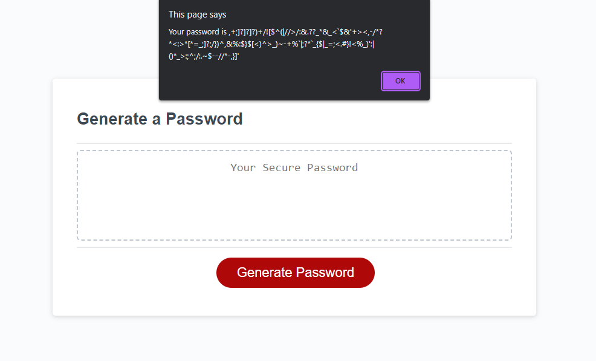
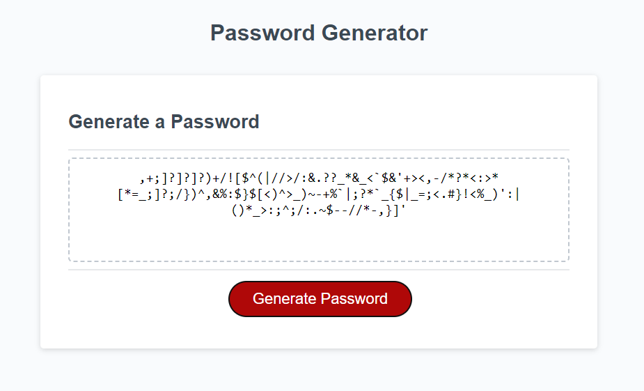

# Module-3-Challenge

## Description
I love JS. I did alot of js back in highschool.<br>
I did not have many issues with this challenge.
<br><br>
10 minutes later I deleted the folder holding all my files...
<br><br>
We made it back! rebuilt but not better haha
<br>
## Deployment Link 🔗

<br>

## User Story 📘
```
AS AN employee with access to sensitive data
I WANT to randomly generate a password that meets certain criteria
SO THAT I can create a strong password that provides greater security
```
<br>

## Acceptance Criteria ✅
```
GIVEN I need a new, secure password
WHEN I click the button to generate a password
THEN I am presented with a series of prompts for password criteria
WHEN prompted for password criteria
THEN I select which criteria to include in the password
WHEN prompted for the length of the password
THEN I choose a length of at least 8 characters and no more than 128 characters
WHEN asked for character types to include in the password
THEN I confirm whether or not to include lowercase, uppercase, numeric, and/or special characters
WHEN I answer each prompt
THEN my input should be validated and at least one character type should be selected
WHEN all prompts are answered
THEN a password is generated that matches the selected criteria
WHEN the password is generated
THEN the password is either displayed in an alert or written to the page
```
<br>

## Deployment gif

<br>

## Deploment Screenshot

<br>

## Deployment Screenshot

<br>

## Credits
Credits to my tutor Stephanie who helped me breakdown this challenge
<br>

## Licence 🔑
MIT © XMoonphaseX